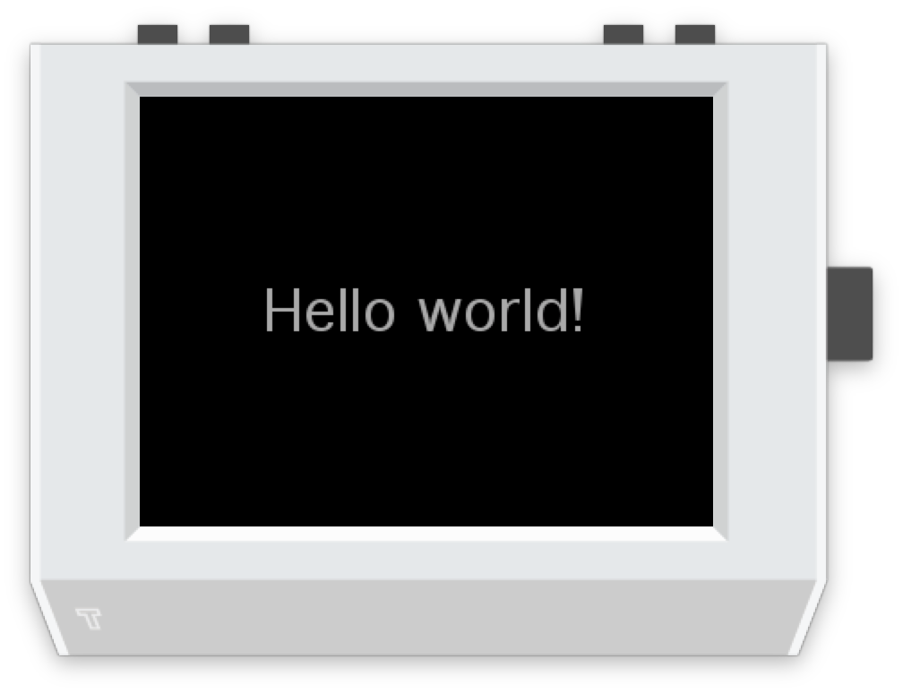
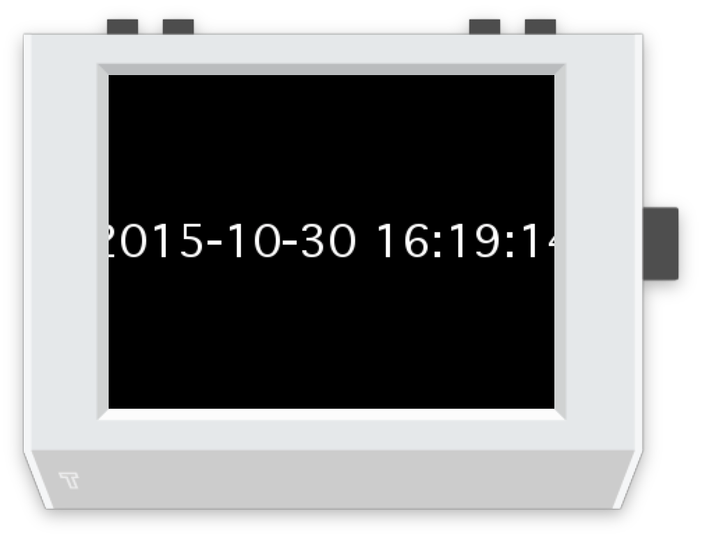
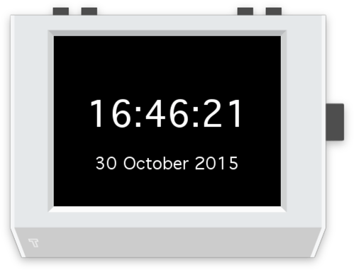

Getting started
===============

A clean slate
-------------

Open up Tide and choose File -&gt; New.

You'll be presented with the app template, which looks like this:

    import tingbot
    from tingbot import *

    # setup code here

    def loop():
        # drawing code here
        screen.fill(color='black')
        screen.text('Hello world!')

    # run the app
    tingbot.run(loop)

This program just writes 'Hello world' to the screen. Try running it!
Click the Run button in the top left of the Tide window to run this code
in the simulator. It'll look like this:

This program consists of a few parts-

### Import

    import tingbot
    from tingbot import *

At the start, we *import* some functionality into the program. Here,
we're importing everything from the tingbot libraries, so we can use
`screen` to draw things to the screen. There are lots of things you can
import, like `import requests` for getting data from the internet, or
`import time` to access the system clock.

### Setup

    # setup code here

This part contains code that runs when your app starts. For this app,
there's no setup required, so there's just a comment.

> **note**
>
> Comments begin with `#`, are used as notes-to-self, or notes to others
> reading this program, and have no effect on how the program runs.

### Loop

    def loop():
        # drawing code here
        screen.fill(color='black')
        screen.text('Hello world!')

In this function, `loop()`, we draw to the screen. This function is run
repeatedly while your program is running.

> **note**
>
> Functions are little bits of code that can be 'called' (meaning run)
> repeatedly from different parts of the program. This loop function is
> given to the tingbot.run() to draw the screen.

### Run

    tingbot.run(loop)

Finally we run the program. This line causes the `loop()` function to be
called over and over, drawing to the screen.

Make a change
-------------

Let's try making a change to our app. We can change the colors using the
color parameter.

    import tingbot
    from tingbot import *

    # setup code here

    def loop():
        # drawing code here
        screen.fill(color='white')
        screen.text('Hello world!', color='blue')

    # run the app
    tingbot.run(loop)

Your first app - a digital clock
--------------------------------

For this app we're going to import some functionality from the Python
[time](https://docs.python.org/2/library/time.html) module.

    import tingbot
    from tingbot import *
    import time

    def loop():
        current_time = time.strftime("%Y-%m-%d %H:%M:%S")

        screen.fill(
            color='black'
        )
        screen.text(
            current_time, 
            color='white'
        )

    tingbot.run(loop)

A few things have changed in the above- we've removed the comments and
split the `fill` and `text` calls to multiple lines. This is just to
make it easier to read.

We've also added a call to `time.strftime`.

> **tip**
>
> Wondering where we got `time.strftime` from? The module `time` is part
> of Python, so it's always available, and you can learn about it from
> the [Python docs](https://docs.python.org/2/library/index.html).
>
> We found it by Googling '[current time
> python](https://google.com/search?q=current+time+python)' and checking
> the first search result!

So now instead of writing 'Hello world' to the screen, we're writing the
current time. It looks like this:

We're getting there!

> **note**
>
> Wondering what the `current_time` is? It's a *variable*. Variables are
> a way to carry data around in a program. So on the line
> `current_time = time.strftime("%Y-%m-%d %H:%M:%S")` we created and set
> the variable, and we used it in the `screen.text` call.

Let's just adjust the formatting.

    import tingbot
    from tingbot import *
    import time

    def loop():
        current_date = time.strftime("%d %B %Y")
        current_time = time.strftime("%H:%M:%S")

        screen.fill(
            color='black'
        )
        screen.text(
            current_time, 
            xy=(160, 110),
            color='white',
            font_size=50,
        )
        screen.text(
            current_date,
            xy=(160, 180),
            color='white',
            font_size=24,
        )

    tingbot.run(loop)

Not bad for 25 lines!
