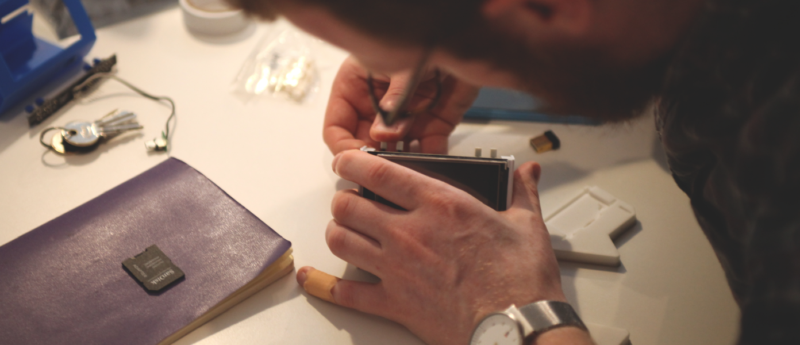
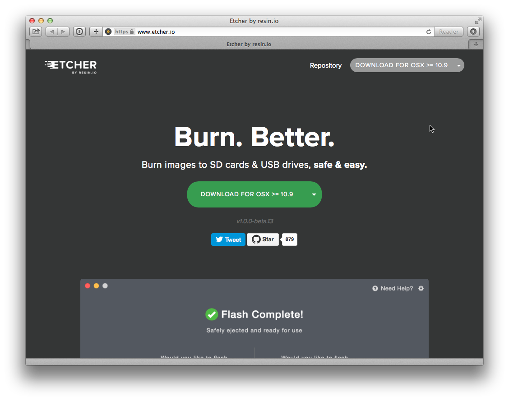
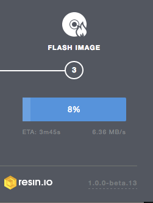
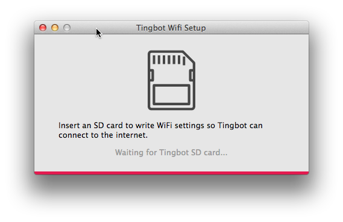
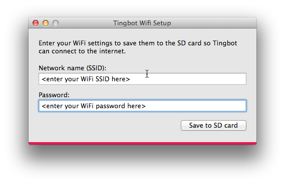

By using Tingbot and Tide you agree with our [terms and conditions](http://tingbot.com/terms/).

---

**NOTE**: We're seeing some reports that the built-in Wifi on the Raspberry Pi 3 isn't working automatically on Tingbot OS. If you have a Pi3, you might have trouble connecting to the Tingbot using Tide. We're working on a fix now. More info: [https://github.com/tingbot/tingbot-os/issues/21](https://github.com/tingbot/tingbot-os/issues/21)

---

Introduction
============

You've followed the [assembly instructions](tingbot-assembly-instructions-v1.pdf), your Tingbot is assembled and ready to go.

During this guide we'll:

* Install Tingbot OS on the Tingbot's SD card
* Install the Tide application (Tingbot's integrated development environment) on your computer
* Get your new Tingbot online
* Test and install the "Hello World" app

A quick note before we begin - you'll need a **microSD card** and a card reader on your computer. We recommend an 8GB or more card, but you could probably get away with 4GB.

Installing Tingbot OS
=====================

Download Tingbot OS
-------------------
Visit [the Tingbot OS releases page](http://github.com/tingbot/tingbot-os/releases/latest) to download the Tingbot **disk.img.zip** and then expand it to **disk.img**. On the Mac the result will look like:

Download and Install Etcher
---------------------------
Visit [etcher.io](http://www.etcher.io) and download Etcher from there. 

Use Etcher to burn the Tingbot OS disk image
--------------------------------------------
Now Etcher has been installed it can be used to burn the Tingbot OS image to the microSD card, as follows

### Select the Tingbot OS image

### Select the Drive image

> **Aside:**
> The above screenshot shows the selection of the Mac's drive that corresponds to the in-built SD card slot that has had the micro SD card inserted (in its SD card adapter). Please make sure on your own machine that the correct drive is selected!

### Flash the image
The time it will take to flash the 1.5GB image will depend on the speed of the micro SD card. Etcher provides a handy ETA to completion!

### Flash complete!

> **Aside:**
> The CRC32 checksum in the above image is likely to be different to the one reported for the final release version.

Installing Tide
===============
Now it's time to download and install the Tide application. Download:

- [<i class="fa fa-apple" aria-hidden="true"></i> Mac](http://tide-download.tingbot.com/download/osx)
- [<i class="fa fa-windows" aria-hidden="true"></i> Windows](http://tide-download.tingbot.com/download/win)
- <a href="http://github.com/tingbot/tide-electron/releases/latest" target="_blank"><i class="fa fa-linux" aria-hidden="true"></i> Linux (choose the .deb or .rpm files)</a>

### Tide's up!
When invoked Tide starts up with an untitled - hello world - template program file. You can find out more about this in the [Writing your first app](/guides/first-app/) section.

 
### Setting up Wifi
Configuring the WiFi settings on the SD card is the next step.

Remove and reinsert the SD card. In Tide, from the menu, choose

- Mac: **Tide** > **Tingbot WiFi Settings...**
- Win/Linux : **File** > **Tingbot WiFi Settings...**

For instance on the Mac:

<!--
> **Note**
> If the Tingbot OS SD card isn't inserted you may get the following prompt:
>
> 
> You might have to remove and then reinsert the SD card. 
-->

Now enter the SSID name and password in the pop-up window:

and when saved to the SD card the following confirmation will be given:

### Time to get coding!

Eject the Tingbot OS SD card, insert the micro SD card into the Tingbot and plug in the Tingbot power supply.

As this is the first time the SD card has been used the Tingbot it will go through a partial boot up sequence to expand the image to the full capacity of the SD card. Once the image has been expanded the Tingbot will automatically reboot - this time to the Home screen - the Tingbot's UI.

Using Tide
----------

### Save as... (and Run)

The first thing to do is to use File -&gt; Save As... (or File -&gt; Save) to save the Untitled template Tingbot application as, say, a file named hello.tingapp. Now 'Run' the program in the Tingbot simulator and the simulated Tingbot will pop up!

### The real ting!

At this point we're sure that you'd like to run the app on the actual Tingbot. Nothing could be simpler! If your Tingbot is booted up then it should be showing the first screen of Springboard. If so all is well. If not, please check back over the previous instructions. If the Tingbot has been able to connect to WiFi then the Tide application should have detected it and the Tingbot's local IP address will appear in the top right hand menu. For instance:  

Let's do this. Select the real Tingbot rather than the simulator and press the Run button again.

In the _console_ at the bottom you'll see the app get copied and started on the Tingbot. Check your Tingbot - it should be saying hello! Hold the two middle buttons on the Tingbot together to return to the home screen.

By using the Run button you can test apps without installing them. Once you're happy with an app, you can install it using the Upload button. Try it! Select the real Tingbot rather than the simulator and notice that the Upload button is enabled. Clicking on this button will cause your app to be uploaded to the Tingbot.

> **Note**
> Scrolling through Springboard will show the newly installed application as 'hello.tingbot' but we'll explain why later.
> If you have scrolled to hello.tingapp you can start it by tapping its screen icon.

### One last Ting!

The reason that the Hello app shows up in Springboard as 'hello.tingapp' is because the [app.tbinfo](/reference/tingapp-format/#tbinfo) has not been updated by the programmer. You can fill in the app.tbinfo like so:

Next up, we'll [explain the process of writing your first Tingbot app](/guides/first-app/).
